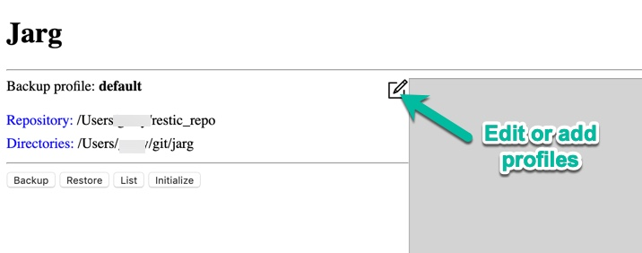
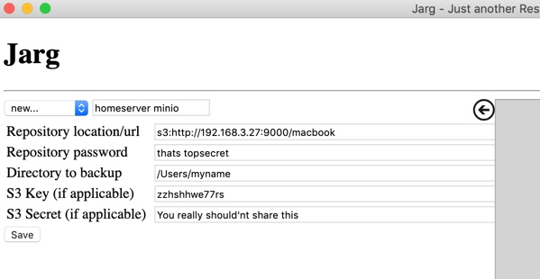

# Jarg - Just another restic GUI

## What is it?

As the name implies, this is a graphical user interface for the backup tool "[restic](https://restic.net)". Restic is a great deduplicating, encrypting backup tool with quite a few possible storage backends, such as 

* Local directory
* sftp
* REST server
* AWS S3 (either from Amazon or using the Minio server)
* OpenStack Swift
* BackBlaze B2
* Microsoft Azure Blob Storage
* Google Cloud Storage

While restic is great for batch usage, the commands are somewhat tedious to remember and enter if you want to use it manually. That's where Jarg comes in:
Jarg is a small [electron](https://electronjs.org) app which does not more than hide the restic commandline behind an easy to use graphical tool. So you first need restic installed in order to use Jarg.

## Installation

* Install [restic](https://restic.readthedocs.io/en/stable/020_installation.html) for your operating system
* Download Jarg for your operating system from the [releases page](https://github.com/rgwch/jarg/releases/tag/0.2.0Beta). *.dmg for macOS, *.appimage for Linux, *.exe for Windows (all 64 Bit only). 

## Concepts

Jarg maintains backup profile for each pair of backup repository location and source location. A backup profile contains the repository location, a password, a source directory and in case of AWS/Minio repositories an s3-key and an s3-secret.

## Usage

On first launch, Jarg will present a "default"-Profile with a 'restic_repo' in your home directory and the current directory as a source dir. 

click one of the buttons to execute the respective restic task. Begin with "initialize" if it's the first access to that repository. 
Restic's output is shown on the right hand side.

To select a different backup profile, or to create a new one, click the  "edit" button.

Choose an existing profile from the selection box or select "new..." and enter a name for the new profile.

Here an example for a [Minio](https://min.io) server in the local network.

* Repository location: See the [restic documentation](https://restic.readthedocs.io/en/latest/030_preparing_a_new_repo.html) for syntax. At this time, only local directory and S3 is supported by Jarg.

* Repository password: Anything you like.

* Directory to backup: The files you want to backup

* S3 key and S3 secret: Only needed with Minio or AWS S3

When done, click save to store the new profile. Klick also save when you only switched backup profiles.

**Important** Jarg does not yet encrypt password and S3 Secret. With some effort, it will be possible to read them from your computer.

## Creating from source

    git clone https://github.com/rgwch/jarg
    cd jarg
    npm install
    npm start

## Package

    npm install -g electron-builder
    npm run build

## Contribute

Contributions are always welcome.

## License

This software is licensed under the terms of the MIT License. Details see [LICENSE](LICENSE)
